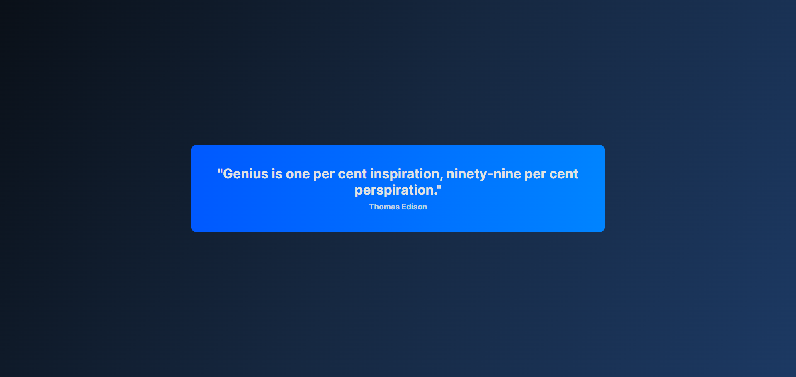

# 💬 Motivational Quote Generator

A simple and clean **Motivational Quote Generator** that gives you a fresh quote every time you click a button. It’s built with **HTML, CSS, and JavaScript**, and uses a small backend to keep things working smoothly.

## 👇 Check It Out
🔗 **[Website](https://quote-generator-server-4x74.onrender.com/)**

## 🚀 Features

* 💡 **Fresh Quotes** – Get a new motivational quote with one click
* 🔄 **Works 24/7** – Backend is hosted online so it’s always available
* 📱 **Responsive Design** – Works great on desktop and mobile

## 📷 Preview

## 🛠️ Technologies Used

* **HTML** – Page structure
* **CSS** – Styling
* **JavaScript** – Frontend logic
* **Node.js** – Backend server (proxy for quotes)
* **Express** – Lightweight web server

## 📖 How to Use

1. Open the website
2. Click the **"Click to get a random quote"** button
3. Read and enjoy a fresh motivational quote each time

## 🌍 Live Hosting

* Backend: Hosted with **Render**

## 🙌 Credits

Quotes provided by [Quotable](https://github.com/lukePeavey/quotable)

